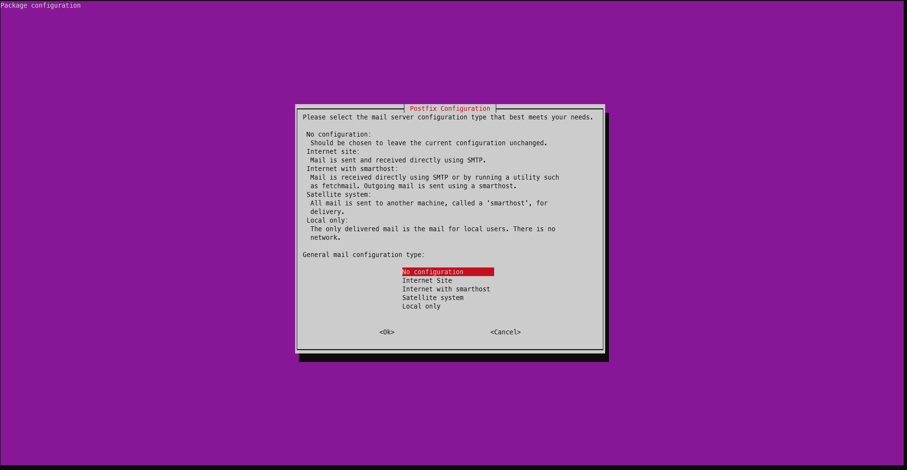
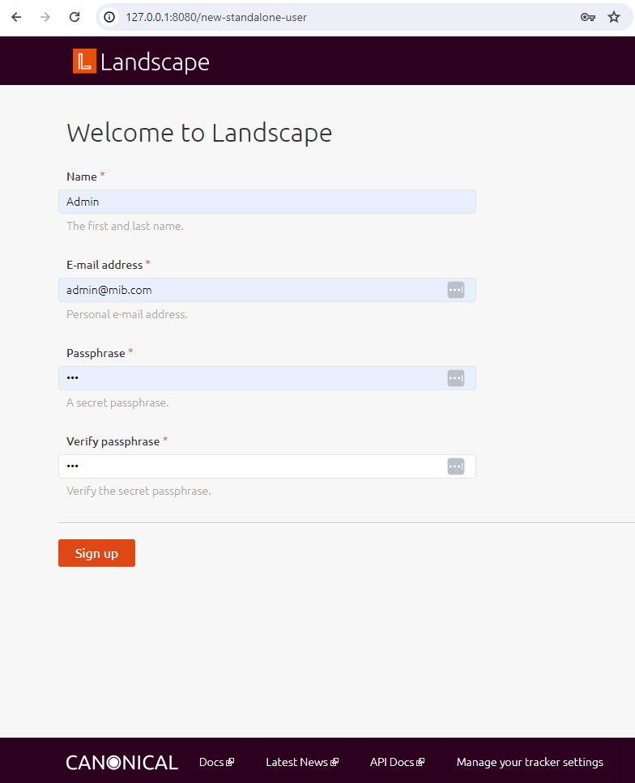
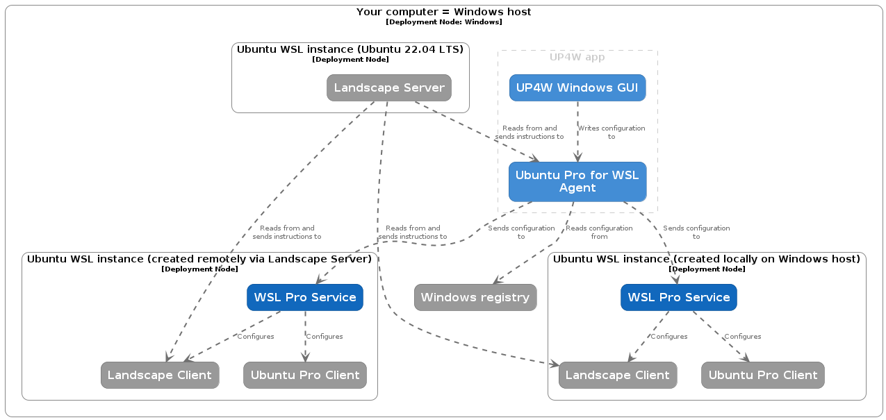

# Install Landscape server in a WSL instance

## Motivation

While a Landscape server typically runs on external computers, it can also be
set up on a WSL instance on a Windows machine.

This is especially useful if you want to test UP4W on a single Windows device.
For example, the [tutorial](../tutorial/index) can be completed with a Landscape
server running in an Ubuntu WSL instance. The Landscape server can then be used
to manage other WSL instances running UP4W and the Landscape client.

(howto::config-landscape-server)=
## Guide

In PowerShell, `shutdown` WSL then install the Ubuntu 24.04 LTS instance with
the `--root` option.

```text
PS C:\Users\me\tutorial> wsl --shutdown

PS C:\Users\me\tutorial> ubuntu2404.exe install --root
```

After successful installation log in to the new instance and add the landscape
apt repository:


```text
PS C:\Users\me\tutorial> ubuntu2204.exe

root@mib:~$ add-apt-repository ppa:landscape/self-hosted-beta -y

```

Update packages and then install the `landscape-server-quickstart` package.

```text
root@mib:~$ apt update

root@mib:~$ apt install landscape-server-quickstart -y
```

A dialog will appear for 'Postfix configuration'. For 'General mail
configuration type' select **No configuration**. Hit **Tab** to highlight the
**Ok** button, press **Enter** and you will be returned to the shell prompt.



If Landscape has installed successfully, the log will indicate that Landscape
systemd units are active. An example log is shown below for the first three
units:

```text
root@mib:~$ systemctl --state=running --no-legend --no-pager | grep -m 3 landscape
  landscape-api.service                 loaded active running LSB: Enable Landscape API
  landscape-appserver.service           loaded active running LSB: Enable Landscape frontend UI
  landscape-async-frontend.service      loaded active running LSB: Enable Landscape async frontend
```

Once installed Landscape will be served on `localhost` port 8080. Open your
favourite browser on Windows and navigate to `http://127.0.0.1:8080` to create
the Landscape global admin account. Enter the following credentials and click
the **Sign Up** button:

| Field             | Value           |
| ----------------- | --------------- |
| Name              | Admin           |
| E-mail address    | `admin@mib.com` |
| Passphrase        | 123             |
| Verify passphrase | 123             |



The Landscape client inside of any WSL instance will need the Landscape server
certificate to connect to the server.

To achieve this copy the Landscape server certificate into your Windows user
profile directory:

```text
root@mib:~$ cp /etc/ssl/certs/landscape_server.pem /mnt/c/users/me/
```

Done -- your self-hosted Landscape server is now up and running!

Now if you configure the Landscape client on any Ubuntu WSL instances to detect
this server, they will also be registered with the Landscape service included
in your Ubuntu Pro subscription.

The server will stay running until you close the terminal. If you do close the
terminal running `ubuntu2404.exe` in a new terminal window will start the
Landscape server automatically.

Using this server setup when following the [tutorial](../tutorial/index) would
result in the following architecture:

 

