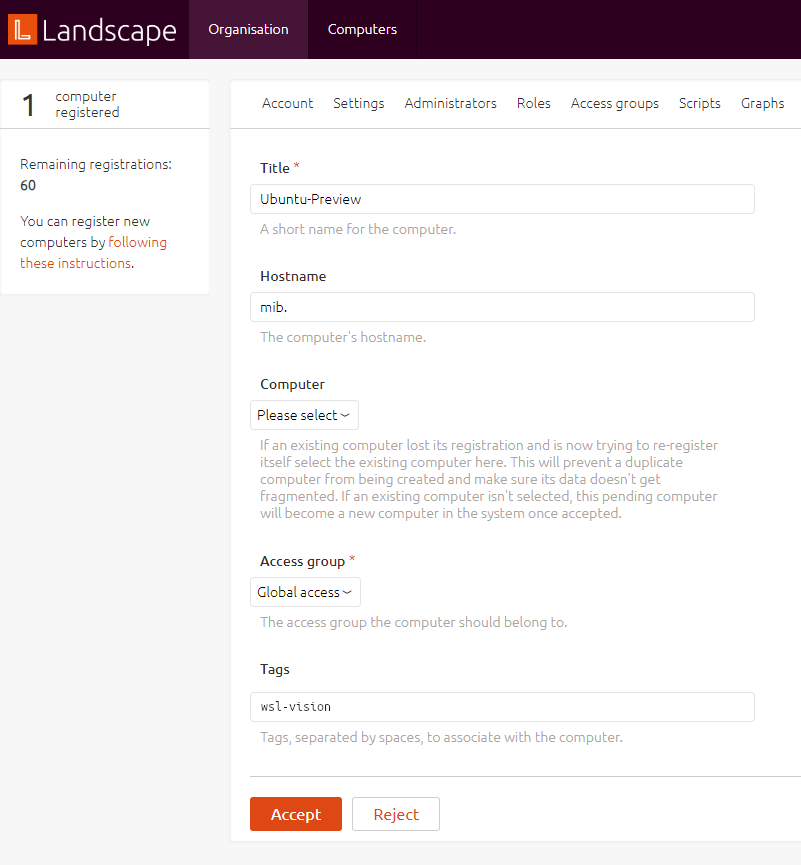
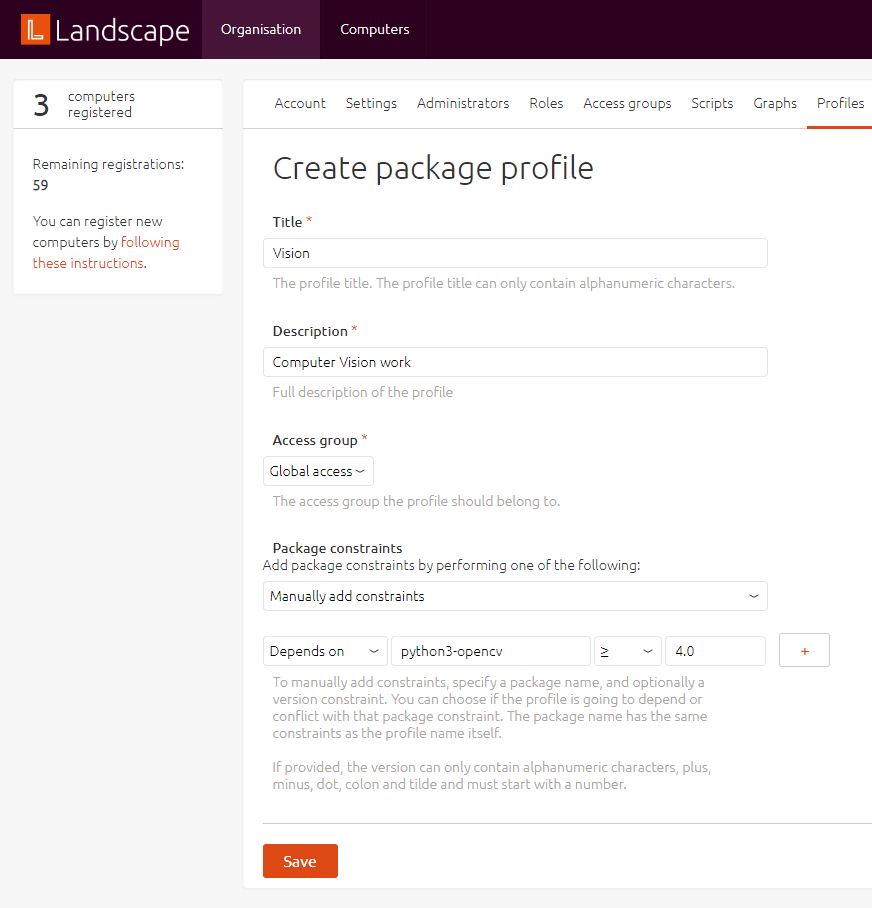
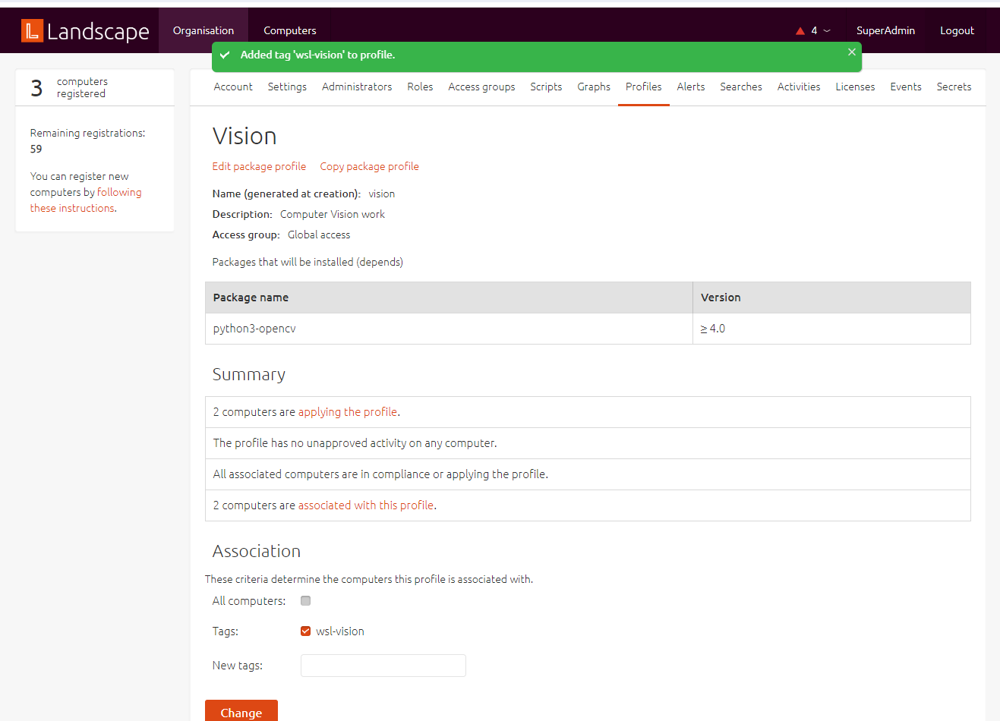
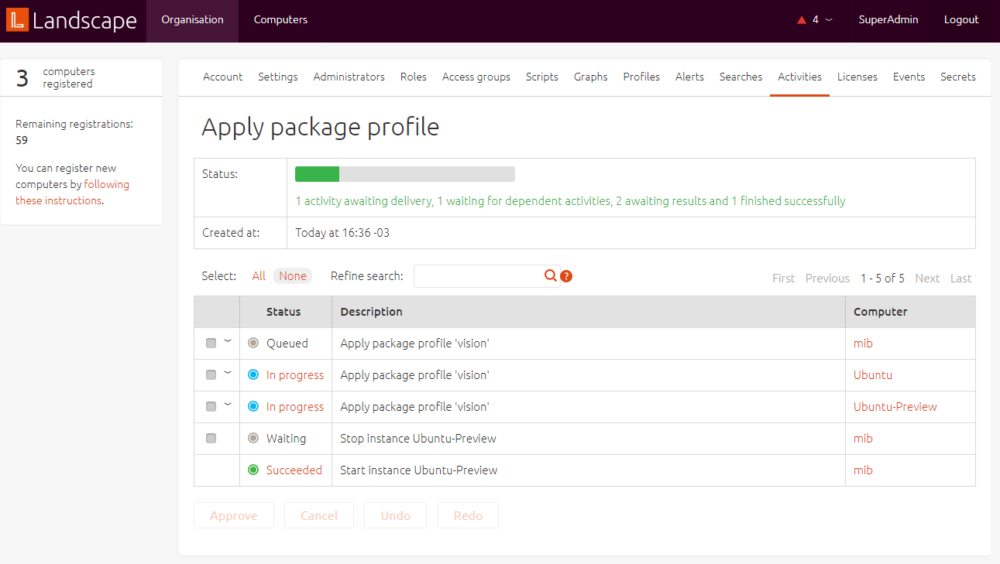

# Get started with UP4W

In this tutorial you will learn all the basic things that you need to know to start taking advantage of your Ubuntu Pro subscription on Ubuntu WSL at scale with Ubuntu Pro for WSL (UP4W).

<br/>

**What you'll need:**

- A Windows 11 machine with access to the Microsoft Store and a minimum of 16GB of RAM and 8-core processor

- Familiarity with the Windows PowerShell

<br/>

**What you'll do:**

- Set things up

- Watch UP4W transform your Ubuntu Pro game on WSL

- Tear things down

<br/>

```{note}
Throughout this tutorial we'll present shell commands together with their output:

- The commands will be prefixed by a
prompt matching the shell it's launched in. 

  For example, `PS C:\Users\me\tutorial>` is a PowerShell prompt where the current working directory is `C:\Users\me\tutorial`, thus running on Windows.


  Similarly, a Linux shell prompt logged in as root with the current working directory as the root home directory will look like `root@hostname:~#`

- The outputs are preserved to give you more context.
```


## Set things up

### Install the Windows Subsystem for Linux (WSL) application

```{warning}
**If you already have it pre-installed:** 

Please reset its configuration to the default settings by (making a backup of your existing `~\.wslconfig` file, then) running:


    PS C:\Users\me\tutorial> Remove-Item ~\.wslconfig

```


See: [Microsoft Store | Windows Subsystem for Linux](https://www.microsoft.com/store/productId/9P9TQF7MRM4R)

All set. From now on you can use it to launch  WSL instances.

<br />

### Install the Ubuntu 22.04 LTS and Ubuntu (Preview) applications

(ref::backup-warning)=
```{warning}
**If you already have them pre-installed:** 

Please export them and delete them. Then proceed with the tutorial and install them fresh from the links provided below. At the end of the tutorial you can re-import them to restore your data.

 <details><summary> How do I export, delete, and re-import Ubuntu 22.04 LTS? </summary>


     PS C:\Users\me\tutorial> wsl --export Ubuntu-22.04 .\backup\Ubuntu-22.04.tar.gz
     Export in progress, this may take a few minutes.
     The operation completed successfully.

     PS C:\Users\me\tutorial> wsl --unregister Ubuntu-22.04
     Unregistering..
     The operation completed successfully.

     PS C:\Users\me\tutorial> wsl --import Ubuntu-22.04 .\backup\Ubuntu-22.04 .\backup\Ubuntu-22.04.tar.gz
     Import in progress, this may take a few minutes.
     The operation completed successfully.

 </details>

<details><summary> How do I export, delete, and re-import Ubuntu (Preview)? </summary>
   
     PS C:\Users\me\tutorial> wsl --export Ubuntu-Preview .\backup\Ubuntu-Preview.tar.gz
     Export in progress, this may take a few minutes.
     The operation completed successfully.

     PS C:\Users\me\tutorial> wsl --unregister Ubuntu-Preview
     Unregistering...
     The operation completed successfully.
	 
     PS C:\Users\me\tutorial> wsl --import Ubuntu-Preview .\backup\Ubuntu-Preview .\backup\Ubuntu-Preview.tar.gz
     Import in progress, this may take a few minutes.
     The operation completed successfully.	 

 </details>
```


See: 
- [Microsoft Store | Ubuntu 22.04 LTS](https://www.microsoft.com/store/productId/9PN20MSR04DW)
- [Microsoft Store | Ubuntu (Preview)](https://www.microsoft.com/store/productId/9P7BDVKVNXZ6)

All set. From now on you can launch WSL instances of the Ubuntu 22.04 LTS and Ubuntu (Preview) releases.

(tut::ensure-ubuntu-pro)=
### Get an Ubuntu Pro subscription token

Visit the Ubuntu Pro page to get a subscription.

> See more: [Ubuntu | Ubuntu Pro > Subscribe](https://ubuntu.com/pro/subscribe). If you choose the personal subscription option (`Myself`), the subscription is free for up to 5 machines. 

Visit your Ubuntu Pro Dashboard to retrieve your subscription token.

> See more: [Ubuntu | Ubuntu Pro > Dashboard](https://ubuntu.com/pro/dashboard)


All set. From now on you can start adding this token to the Ubuntu Pro client on your WSL instances so you can enjoy Ubuntu Pro benefits on WSL as well. 


### Set up a Landscape server

```{warning}
**If you already have one:**

Please ignore it and proceed to set up a fresh one as shown below. As your version might differ from the one we assume here, this will guarantee the smoothest experience.
```

Landscape servers are usually on external computers. However, for the purpose of this tutorial we will set one up on a WSL instance on your Windows machine.

In your Windows PowerShell, `shutdown` WSL, then install the Ubuntu 22.04 LTS instance with the `--root` option.

```powershell
# Ensure a clean WSL environment.
PS C:\Users\me\tutorial> wsl --shutdown

PS C:\Users\me\tutorial> ubuntu2204.exe install --root
Installing, this may take a few minutes...
Installation successful!

```

Once this has completed, still in PowerShell, log in to the new instance, add the
apt repository `ppa:landscape/self-hosted-beta`, and install the package `landscape-server-quickstart`:

```{warning}
**This will take 5-10 minutes.**

That is because the server is composed of many packages and the
performance of the installation is affected by the WSL networking, as well as the host machine power.
```

```bash
PS C:\Users\me\tutorial> ubuntu2204.exe
Welcome to Ubuntu 22.04.3 LTS (GNU/Linux 5.15.146.1-microsoft-standard-WSL2 x86_64)

 * Documentation:  https://help.ubuntu.com
 * Management:     https://landscape.canonical.com
 * Support:        https://ubuntu.com/pro

  System information as of Fri Feb 16 02:21:51 -03 2024

  System load:  0.57                Processes:             54
  Usage of /:   0.1% of 1006.85GB   Users logged in:       1
  Memory usage: 25%                 IPv4 address for eth0: 172.18.68.146
  Swap usage:   4%


This message is shown once a day. To disable it please create the
/root/.hushlogin file.

# Adding the Landscape Beta PPA:
root@mib:~# add-apt-repository ppa:landscape/self-hosted-beta -y
Repository: 'deb https://ppa.launchpadcontent.net/landscape/self-hosted-beta/ubuntu/ jammy main'
Description:
Dependencies for Landscape Server Self-Hosted Beta.
More info: https://launchpad.net/~landscape/+archive/ubuntu/self-hosted-beta
Adding repository.
Adding deb entry to /etc/apt/sources.list.d/landscape-ubuntu-self-hosted-beta-jammy.list
Adding disabled deb-src entry to /etc/apt/sources.list.d/landscape-ubuntu-self-hosted-beta-jammy.list
Adding key to /etc/apt/trusted.gpg.d/landscape-ubuntu-self-hosted-beta.gpg with fingerprint 35F77D63B5CEC106C577ED856E85A86E4652B4E6
Hit:1 http://security.ubuntu.com/ubuntu jammy-security InRelease
Hit:2 http://archive.ubuntu.com/ubuntu jammy InRelease
Hit:3 http://archive.ubuntu.com/ubuntu jammy-updates InRelease
Hit:4 http://ppa.launchpad.net/ubuntu-wsl-dev/ppa/ubuntu jammy InRelease
Hit:5 http://archive.ubuntu.com/ubuntu jammy-backports InRelease
Hit:6 http://ppa.launchpad.net/landscape/self-hosted-beta/ubuntu jammy InRelease
Hit:7 http://ppa.launchpad.net/cloud-init-dev/proposed/ubuntu jammy InRelease
Get:8 https://ppa.launchpadcontent.net/landscape/self-hosted-beta/ubuntu jammy InRelease [17.5 kB]
Get:9 https://ppa.launchpadcontent.net/landscape/self-hosted-beta/ubuntu jammy/main amd64 Packages [13.4 kB]
Get:10 https://ppa.launchpadcontent.net/landscape/self-hosted-beta/ubuntu jammy/main Translation-en [8784 B]
Fetched 39.7 kB in 2s (21.9 kB/s)
Reading package lists... Done

root@mib:~# apt update
Hit:1 http://security.ubuntu.com/ubuntu jammy-security InRelease
Hit:2 http://archive.ubuntu.com/ubuntu jammy InRelease
Hit:3 http://ppa.launchpad.net/ubuntu-wsl-dev/ppa/ubuntu jammy InRelease
Hit:4 http://archive.ubuntu.com/ubuntu jammy-updates InRelease
Hit:5 http://archive.ubuntu.com/ubuntu jammy-backports InRelease
Hit:6 http://ppa.launchpad.net/landscape/self-hosted-beta/ubuntu jammy InRelease
Hit:7 http://ppa.launchpad.net/cloud-init-dev/proposed/ubuntu jammy InRelease
Hit:8 https://ppa.launchpadcontent.net/landscape/self-hosted-beta/ubuntu jammy InRelease
Reading package lists... Done
Building dependency tree... Done
Reading state information... Done
24 packages can be upgraded. Run 'apt list --upgradable' to see them.

# Installing the Landscape Server Quickstart package:
root@mib:~# apt install landscape-server-quickstart -y
```

When the installation  process prompts about  Postfix configuration: Under 'General mail configuration type' select **No configuration** and hit **Tab**; then, with the **Ok** button highlighted, press **Enter**.


That should bring you back to your shell prompt and you should see the installation unfolding. If it completes successfully, the last few log lines should look as below, with the Landscape systemd units appearing as active.


```bash

# The last log lines of the installation process will be similar to this:
  en_ZM.UTF-8... done
  en_ZW.UTF-8... done
Generation complete.
Setting up landscape-server-quickstart (23.10+6-0landscape0) ...
Generating self-signed certificate/key pair.
If you want to use your own, place the certificate file in
/etc/ssl/certs/landscape_server.pem and the key file in /etc/ssl/private/landscape_server.key, and reconfigure this package.
.+..+.+...................................+..........+..+++++++++++++++++++++++++++++++++++++++++++++++++++++++++++++++++*...............+...+..+.+.........+...+.........+........+.+..+.......+.....+................+..+...+.......+...+......+...+..+....+++++++++++++++++++++++++++++++++++++++++++++++++++++++++++++++++*................+.....+....+.....+.+.....+......+.+...............+........+....+...+.........+....................+...+...+..................+.+......+..+...+...+.......+...+......+.....+...+.+......+.....+.............+..+.........+................+........+.+..+.......+.....+...+...+.+.....+....+.....+......+....+.....+.........+.......+.....+......+...+......+.+.....+.......+.....+......+++++++++++++++++++++++++++++++++++++++++++++++++++++++++++++++++
.....+..................+...+++++++++++++++++++++++++++++++++++++++++++++++++++++++++++++++++*.+..................+.+++++++++++++++++++++++++++++++++++++++++++++++++++++++++++++++++*.................+.+..+...............+......+....+...........+.........+.+...........+.+.....+...+....+...+..+...+.........+....+...........+...................+..............+.+......+........+......+.+......+...............+..+...+....+...+......+............+++++++++++++++++++++++++++++++++++++++++++++++++++++++++++++++++
-----
Site 000-default disabled.
2024-02-16 06:02:43.284Z INFO landscape-quickstart "Upgrading service.conf ..."
2024-02-16 06:02:43.337Z INFO landscape-quickstart "Updated message-server section."
2024-02-16 06:02:43.339Z INFO landscape-quickstart "Updated landscape section."
2024-02-16 06:02:43.346Z INFO landscape-quickstart "Checking local RabbitMQ settings."
2024-02-16 06:02:44.373Z INFO landscape-quickstart "Configuring RabbitMQ for Landscape ..."
2024-02-16 06:02:48.196Z INFO landscape-quickstart "Setting up Apache SSL configuration ..."
2024-02-16 06:02:48.248Z INFO landscape-quickstart "Configuring PostgreSQL for Landscape"
2024-02-16 06:02:48.268Z INFO landscape-quickstart "Skipping configuration migration ..."
2024-02-16 06:02:48.269Z INFO landscape-quickstart "Bootstrapping service.conf using psql ..."
2024-02-16 06:02:48.406Z INFO landscape-quickstart "Created user 'landscape'."
2024-02-16 06:02:48.478Z INFO landscape-quickstart "Created user 'landscape_superuser'."
2024-02-16 06:02:48.480Z INFO landscape-quickstart "Checking Landscape databases ..."
2024-02-16 06:02:50.343Z INFO landscape-quickstart "Checking database schema ..."
2024-02-16 06:02:58.942Z INFO landscape-quickstart "Schema configuration output:\n\nLoading site configuration...\nWARNING: PostgreSQL has max_prepared_transactions set to 0, not using two-phase commit.\nSetting up database schemas (will timeout after 86400 seconds) ...\nSchema patch version: 499\n"
2024-02-16 06:02:58.942Z INFO landscape-quickstart "Checking package database initial data ..."
2024-02-16 06:02:59.016Z INFO landscape-quickstart "Loading stock package database ..."
2024-02-16 06:09:44.485Z INFO landscape-quickstart "Stock package database loaded successfully."
2024-02-16 06:09:44.502Z INFO landscape-quickstart "Renaming stock hash-id stores ..."
2024-02-16 06:09:48.964Z INFO landscape-quickstart "Renamed 33 stock hash-id stores against uuid fd2e9fc2-cc91-11ee-afea-4d057cae229c"
Processing triggers for libc-bin (2.35-0ubuntu3.6) ...
Processing triggers for rsyslog (8.2112.0-2ubuntu2.2) ...
Processing triggers for ufw (0.36.1-4ubuntu0.1) ...
Processing triggers for man-db (2.10.2-1) ...
Processing triggers for dbus (1.12.20-2ubuntu4.1) ...

# Check that no Landscape systemd unit is failed:
root@mib:~# systemctl --state=failed --no-legend --no-pager | grep landscape # Outputs nothing
root@mib:~# systemctl --state=running --no-legend --no-pager | grep landscape
  landscape-api.service                 loaded active running LSB: Enable Landscape API
  landscape-appserver.service           loaded active running LSB: Enable Landscape frontend UI
  landscape-async-frontend.service      loaded active running LSB: Enable Landscape async frontend
  landscape-hostagent-consumer.service  loaded active running Landscape's WSL Message Consumer
  landscape-hostagent-messenger.service loaded active running Landscape's WSL Message Service
  landscape-job-handler.service         loaded active running LSB: Enable Landscape job handler
  landscape-msgserver.service           loaded active running LSB: Enable Landscape message processing
  landscape-package-search.service      loaded active running Landscape's Package Search daemon
  landscape-package-upload.service      loaded active running LSB: Enable Landscape Package Upload service
  landscape-pingserver.service          loaded active running LSB: Enable Landscape ping server
  landscape-secrets-service.service     loaded active running Landscape's Secrets Management Service
```

Once the installation has completed, Landscape will be served on `localhost` port 8080. Open your favourite browser on Windows and enter the address `http://127.0.0.1:8080`. It will show the page to create the Landscape global
admin account. Enter the following credentials and click the **Sign Up** button:

| Field             | Value           |
| ----------------- | --------------- |
| Name              | Admin           |
| E-mail address    | `admin@mib.com` |
| Passphrase        | 123             |
| Verify passphrase | 123             |


Finally, copy the Landscape server certificate into your Windows user profile directory. The Landscape client inside of any WSL
instance will need that certificate to connect to the server.

```bash
root@mib:~# cp /etc/ssl/certs/landscape_server.pem /mnt/c/users/me/
root@mib:~#
```

Done -- your self hosted Landscape server is now up and running! At this point, if you configure the Landscape client on your Ubuntu WSL instances to know about this server, that will register them with the Landscape service included in your Ubuntu Pro subscription as well, and you'll be able to manage these instances at scale from your Landscape server.

Keep the current terminal open so the server stays running while you continue on with this tutorial.

```{note}
**If you accidentally close the terminal**:

Open a new terminal window and run `ubuntu2204.exe`. Landscape server and related components will start automatically.
```


### Install UP4W

% :TODO: remove this warning once the app is made generally available (after the beta period).

```{warning}
The install link below will work only if you're logged in to the Microsoft Store with an account for which access to the app has been enabled.
```

Time to install UP4W! Click on [this link](https://www.microsoft.com/store/productId/9PD1WZNBDXKZ), then on the big blue **Install** button.


Once the installation is complete, you will see a **Start** button. Click it. That will start the UP4W Windows application. We'll use it to configure UP4W at next.


```{note}
Instead of using the GUI, it's possible to configure UP4W through the Windows registry, which enables you to do things at scale.
```

### Configure UP4W for Ubuntu Pro and Landscape

In the UP4W GUI click in the label "Already have a token?" to expand the Ubuntu Pro token input field.


Paste your token retrieved from your Ubuntu Pro dashboard during [Setup](tut::ensure-ubuntu-pro) and click on the "Confirm" button (the button becomes green when there is a valid token in the input field). The app will then show the Landscape configuration screen.

Create a new file in your home directory named `landscape.txt` and enter following contents, replacing:

- `<HOSTNAME>` by the actual host name of your Windows machine and
- `<YOUR_WINDOWS_USER_NAME>` by the actual user name of your Windows account

```
[host]
url = [::1]:6554
[client]
account_name = standalone
registration_key =
url = https://<HOSTNAME>/message-system
log_level = debug
ping_url = https://<HOSTNAME>/ping
ssl_public_key = C:\Users\<YOUR_WINDOWS_USER_NAME>\landscape_server.pem
```
% If really needed we can start without the SSL public key and add it after the Windows host is registered in Landscape.


Then load that file using the "Custom Configuration" part of the the screen, as shown below:


Click on the "Continue" button. You'll see a status screen confirming the configuration is complete.


Done! You can close the UP4W window if you want.

This has attached your Ubuntu Pro subscription to UP4W on the Windows host; UP4W will automatically forward it to the Ubuntu Pro client on your Ubuntu WSL instances; thus, all of your Ubuntu WSL instances will be automatically added to your Ubuntu Pro subscription.

This has also configured the Landscape client built into your UP4W Windows agent to know about your Landscape server; UP4W will forward this configuration to the Landscape client on your Ubuntu WSL instances as well; and all systems where the Landscape client has been configured this way are automatically registered with Landscape.


### Approve your UP4W Windows host registration with Landscape

Go back to the Windows web browser and refresh the Landscape page. On the right-hand side of the main content area of the
page you should see a request to approve your Windows host registration ("Computers needing authorisation").
Click on the computer name (below, `mib`); then, when the new page loads, click **Accept**.

```{note}
**If you've already closed the browser tab**:

Just open a new one, navigate to `http://127.0.0.1:8080` and log in with the credentials you created earlier.
```


At the top of the page, on the right-hand side of the Landscape logo, click on "Computers". You should see your host machine listed there. Details such as the operating system may take a few minutes to appear.


All set. From now on you can use your Landscape server not just to manage the Ubuntu WSL instances that UP4W has pro-attached and Landscape-registered on the host, but to tell UP4W to create and provision them on the host too!


## Watch UP4W transform your Ubuntu Pro game on WSL!

### Create an Ubuntu WSL instance locally and watch it be automatically pro-attached and Landscape-registered

Open the Windows PowerShell and run the following command to create a new Ubuntu-Preview instance.
When prompted create the default user and password. For convenience, we'll set both to `u`.
When done you'll be logged in to the new instance shell.

```powershell
PS C:\Users\me\tutorial> ubuntupreview.exe

Installing, this may take a few minutes...
Please create a default UNIX user account. The username does not need to match your Windows username.
For more information visit: https://aka.ms/wslusers
Enter new UNIX username: u
New password:
Retype new password:
passwd: password updated successfully
Installation successful!
To run a command as administrator (user "root"), use "sudo <command>".
See "man sudo_root" for details.

u@mib:~$

```


UP4W should have already pro-attached this instance. To verify:

- Run `pro status`

You should see some services enabled (for now, ESM) and the account and subscription information at the bottom of the output:


```bash
u@mib:~$ pro status
SERVICE          ENTITLED  STATUS       DESCRIPTION
esm-apps         yes       enabled      Expanded Security Maintenance for Applications
esm-infra        yes       enabled      Expanded Security Maintenance for Infrastructure

NOTICES
Operation in progress: pro attach

For a list of all Ubuntu Pro services, run 'pro status --all'
Enable services with: pro enable <service>

     Account: me@ubuntu.com
Subscription: Ubuntu Pro - free personal subscription
u@mib:~$
```


- Run `sudo apt update`

You should notice in the output that you’re accessing packages from all the enabled services (for now, ESM):

```bash
u@mib:~$ sudo apt update
Hit:1 http://archive.ubuntu.com/ubuntu noble InRelease
Hit:2 http://ppa.launchpad.net/ubuntu-wsl-dev/ppa/ubuntu noble InRelease
Hit:3 http://security.ubuntu.com/ubuntu noble-security InRelease
Hit:4 http://archive.ubuntu.com/ubuntu noble-updates InRelease
Hit:5 http://ppa.launchpad.net/landscape/self-hosted-beta/ubuntu noble InRelease
Hit:6 https://esm.ubuntu.com/apps/ubuntu noble-apps-security InRelease
Hit:7 http://archive.ubuntu.com/ubuntu noble-backports InRelease
Hit:8 http://ppa.launchpad.net/cloud-init-dev/proposed/ubuntu noble InRelease
Hit:9 https://esm.ubuntu.com/infra/ubuntu noble-infra-security InRelease        # Notice the ESM repositories
Reading package lists... Done
Building dependency tree... Done
Reading state information... Done
All packages are up to date.
```

UP4W should have also already Landscape-registered this instance:

- To verify, refresh your Landscape server web page - you should see it listed under the "Computers needing authorisation" section.


- To accept the registration first click on the instance name and in the pop-up set "Tags" to `wsl-vision` then click **Accept**




### Use Landscape to create a pro-attached and Landscape-registered Ubuntu WSL instance remotely

Back to your Windows browser, at the Landscape page, navigate to "Computers" and click on the Windows machine (below, `mib`). You'll find the "WSL Instances" on the right-hand side of the page and an "Install new" link close to it.
Click on that link. Once the page has loaded, set "Instance Type" to "Ubuntu", then click "Submit". A status page will
appear showing the progress of the new instance creation.


Your Landscape Server will talk to the Landscape client built into your UP4W and ask UP4W to install the `Ubuntu` application and create an Ubuntu WSL instance for you. In your PowerShell, run `ubuntu.exe` to log in to the new instance.

```powershell
PS C:\Users\me\tutorial> ubuntu.exe
To run a command as administrator (user "root"), use "sudo <command>".
See "man sudo_root" for details.

Welcome to Ubuntu 22.04.3 LTS (GNU/Linux 5.15.146.1-microsoft-standard-WSL2 x86_64)

 * Documentation:  https://help.ubuntu.com
 * Management:     https://landscape.canonical.com
 * Support:        https://ubuntu.com/advantage


This message is shown once a day. To disable it please create the
/home/me/.hushlogin file.
me@mib:~$
```

As usual, this instance is pro-attached and Landscape-registered -- run `pro status` to verify the pro-attachment and refresh your Landscape server page to verify and accept the registration (as before, apply the  `wsl-vision` tag and click `Accept`).


### Use Landscape to deploy packages to all of your Ubuntu WSL instances at once

On your Landscape server page, navigate to `Organization` > `Profiles` and click on
`Package Profiles`, then `Add package profile`. Fill in the form with the following values and click "Save".

| Field               | Value                                  |
| ------------------- | -------------------------------------- |
| Title               | Vision                                 |
| Description         | Computer Vision work                   |
| Access group        | Global                                 |
| Package constraints | Manually add constraints               |
|                     | Depends on `python3-opencv` `>=` `4.0` |



On the bottom of the "Vision" profile page, in the "Association" section, set the "New tags" field to `wsl-vision` (the tag we used above for all the instances we accepted into Landscape) and click **Change**.



In the "Summary" section in the middle of the page you will see a status message showing that 2 computers are `applying the profile`. Click on the `applying the profile` link and then, in the "Activities" list, click on **Apply package profile** to see the progress of the package deployment.



When this process has completed, use one of your instance shells to verify that the `python3-opencv` package has been installed.
For example, in the `Ubuntu` instance it would look as below:

```bash
me@mib:~$ apt list --installed | grep opencv

WARNING: apt does not have a stable CLI interface. Use with caution in scripts.

libopencv-calib3d4.5d/jammy,now 4.5.4+dfsg-9ubuntu4 amd64 [installed,automatic]
libopencv-contrib4.5d/jammy,now 4.5.4+dfsg-9ubuntu4 amd64 [installed,automatic]
libopencv-core4.5d/jammy,now 4.5.4+dfsg-9ubuntu4 amd64 [installed,automatic]
libopencv-dnn4.5d/jammy,now 4.5.4+dfsg-9ubuntu4 amd64 [installed,automatic]
libopencv-features2d4.5d/jammy,now 4.5.4+dfsg-9ubuntu4 amd64 [installed,automatic]
libopencv-flann4.5d/jammy,now 4.5.4+dfsg-9ubuntu4 amd64 [installed,automatic]
libopencv-highgui4.5d/jammy,now 4.5.4+dfsg-9ubuntu4 amd64 [installed,automatic]
libopencv-imgcodecs4.5d/jammy,now 4.5.4+dfsg-9ubuntu4 amd64 [installed,automatic]
libopencv-imgproc4.5d/jammy,now 4.5.4+dfsg-9ubuntu4 amd64 [installed,automatic]
libopencv-ml4.5d/jammy,now 4.5.4+dfsg-9ubuntu4 amd64 [installed,automatic]
libopencv-objdetect4.5d/jammy,now 4.5.4+dfsg-9ubuntu4 amd64 [installed,automatic]
libopencv-photo4.5d/jammy,now 4.5.4+dfsg-9ubuntu4 amd64 [installed,automatic]
libopencv-shape4.5d/jammy,now 4.5.4+dfsg-9ubuntu4 amd64 [installed,automatic]
libopencv-stitching4.5d/jammy,now 4.5.4+dfsg-9ubuntu4 amd64 [installed,automatic]
libopencv-video4.5d/jammy,now 4.5.4+dfsg-9ubuntu4 amd64 [installed,automatic]
libopencv-videoio4.5d/jammy,now 4.5.4+dfsg-9ubuntu4 amd64 [installed,automatic]
libopencv-viz4.5d/jammy,now 4.5.4+dfsg-9ubuntu4 amd64 [installed,automatic]
python3-opencv/jammy,now 4.5.4+dfsg-9ubuntu4 amd64 [installed,automatic]
```

Congratulations -- now that UP4W has removed all the pro-attachment and Landscape-registration hassle, you can quickly skip to using Landscape to manage all your Ubuntu WSL instances at scale!


*Your Windows host with your Landscape server and two Ubuntu WSL instances pro-attached and Landscape-registered through UP4W.*

## Tear things down

### Uninstall UP4W

In the Windows Start Menu, locate the "Ubuntu Pro for WSL" application and right-click on it, then select "Uninstall".


Additionally remove the `.ubuntupro` directory from your Windows user profile directory.

```powershell
PS C:\Users\me\tutorial> Remove-Item -Recurse -Force C:\Users\me\.ubuntupro
```

### Remove the Ubuntu WSL apps

```{warning}
**If you already have them pre-installed:**

Refer to the [backup instructions](ref::backup-warning) to restore your pre-existing instances.

Otherwise, proceed with the commands below.
```

In PowerShell run the following command to stop WSL:

```powershell
PS C:\Users\me\tutorial> wsl --shutdown
```

Then, in the Windows Start Menu, locate the "Ubuntu 22.04 LTS" application, right-click on it, and select "Uninstall",
as done with UP4W. Do the same for the "Ubuntu (Preview)" and "Ubuntu" applications.

The instances will be removed automatically.

### Optionally remove the WSL application

Only do this if you don't need WSL in this Windows machine for any other reason.

As before, in the Windows Start Menu, locate the "WSL" application, right-click on it, and select "Uninstall".

## Next steps

This tutorial has introduced you to all the basic things you can do with UP4W. But there is more to explore:

| IF YOU ARE WONDERING…          | VISIT…              |
| ------------------------------ | ------------------- |
| “How do I…?”                   | UP4W How-to docs    |
| “What is…?”                    | UP4W Reference docs |
| “How do I contribute to UP4W?” | Developer docs      |

%| “Why…?”, “So what?”	UP4W Explanation docs 


